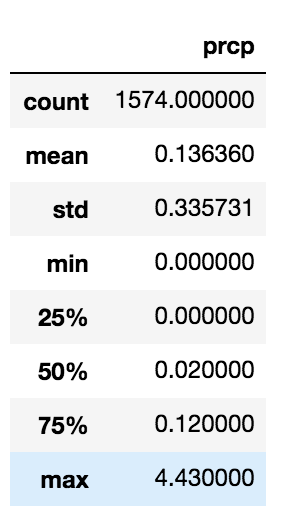
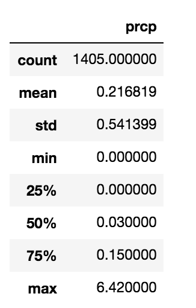

# Advanced Data Storage and Retrieval with Flask
The purpose of this project is to analyze weather data using Flask application

## Overview of Project
To analyze precipitation levels and show the cold, hard, weather data with the following tasks to complete:
•	Determine the summary statistic for June.
•	Determine the summary statistic for December.

## Resources
- Data Sources: hawaii.sqlite
- Software: SQLite, SQLAlchemy, Jupyter Notebook and Flask

## Results
Based on the analysis, there are three key differences in weather between June and December:
* There is an 8 degree difference in the minimum.
* A difference of 3-4 degrees on all measurements except for the maximum
* The maximum range is only 2 between the two months

## Summary
One each additional query to gather more weather data for the months of June and December for precipitation analysis. These additional queries may provide insight into the temperature differences revealed in the initial queries.

June Precipitation

December Precipitation

